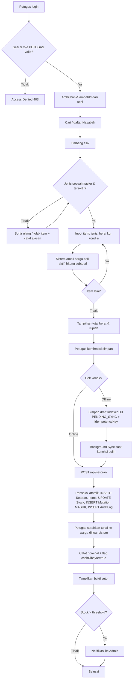
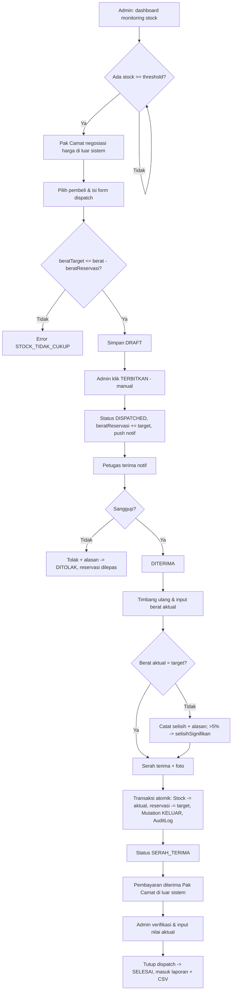
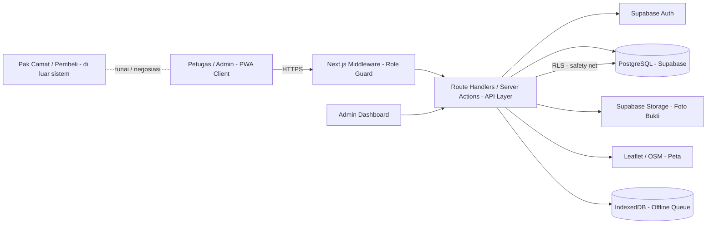
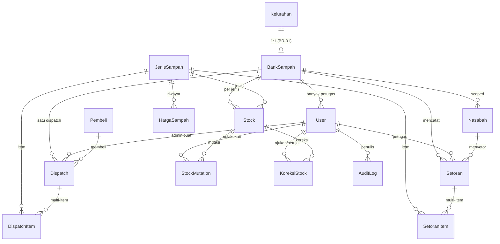

# PRD — Bank Sampah Digital Kecamatan

**Versi:** 1.0
**Tanggal:** 12 Agustus 2026
**Sumber:** Notulensi 3 Agustus 2026 + Board Whimsical "Bank Sampah Digital — Logic"
**Status:** Siap dieksekusi, dengan 6 keputusan terbuka di Bagian 8 (Keputusan Terbuka)

---

## Cara Membaca Dokumen Ini

Dokumen ini adalah **aturan main**, bukan referensi bacaan. Kalau ada pertanyaan saat coding, jawabannya harus ada di sini. Kalau tidak ada, itu artinya dokumen ini perlu diperbarui — jangan diputuskan sendiri di dalam kode.

| Penanda | Arti |
|---|---|
| **[WAJIB]** | Tidak boleh dilanggar. PR ditolak kalau melanggar. |
| **[DEFAULT]** | Keputusan sementara yang saya ambil. Boleh diubah, tapi harus lewat rapat. |
| **[TBD]** | Belum diputuskan. Jangan dikerjakan dulu. |

---

# 1. Overview

## 1.1 Executive Summary

Kecamatan ini memiliki bank sampah di setiap kelurahan, namun pencatatan setoran warga masih manual di buku tulis. Akibatnya kecamatan tidak memiliki visibilitas atas total stock sampah plastik, tidak punya dasar data saat menegosiasikan harga, serta rawan selisih pada rekap penjualan.

Aplikasi web berbasis **PWA** akan mencatat setoran sampah plastik dari warga, memantau stock per bank sampah, dan mengelola penjualan stock ke pembeli (pengepul). Sistem berfokus pada ketertelusuran (audit trail penuh), keamanan berlapis, dan kemampuan beroperasi offline untuk alur setoran di lokasi dengan sinyal lemah.

## 1.2 Problem Statement & Goals

**Masalah:**
- Kecamatan tidak tahu berapa total stock sampah plastik yang tersedia.
- Tidak ada dasar data saat Pak Camat menegosiasikan harga dengan pembeli.
- Rekap penjualan sulit disusun dan rawan selisih.
- Riwayat setoran warga tidak bisa ditelusuri kalau buku hilang.

**Tujuan & Key Success Metrics (KPIs):**

| # | Goal | KPI / Success Metric |
|---|---|---|
| G1 | Visibilitas stock se-kecamatan | 100% bank sampah aktif tercatat di tabel + peta monitoring |
| G2 | Ketertelusuran transaksi | 100% aksi tulis memiliki `AuditLog` (payloadBefore/after) |
| G3 | Akurasi stock | Stock tidak pernah minus (`CHECK` constraint + validasi API) |
| G4 | Operasional di sinyal lemah | Alur setoran bisa diselesaikan offline & tersinkron saat koneksi pulih (idempoten) |
| G5 | Keamanan akses | 0 kebocoran `passwordHash`/`SERVICE_ROLE_KEY`; guard 3 lapis aktif |
| G6 | Laporan akurat | Laporan volume & penjualan bisa diekspor CSV tanpa selisih retroaktif |
| G7 | Penjualan tanpa dobel jual | Reservasi stock mencegah 1 stock dijanjikan ke 2 pembeli |

## 1.3 Scope & Out-of-Scope

**Yang MASUK sistem ([WAJIB] — jangan bangun di luar area ini tanpa perubahan PRD):**

- Pencatatan setoran sampah dari warga
- Stock per bank sampah per jenis sampah
- Dispatch penjualan stock ke pembeli
- Monitoring stock se-kecamatan (tabel + peta)
- Laporan dan export CSV
- Audit trail semua aksi tulis

**Yang TIDAK masuk sistem (out-of-scope, MVP):**

| Aktivitas | Status |
|---|---|
| Pembayaran uang ke warga | Tunai konvensional. Sistem hanya mencatat nominal + flag lunas. |
| Negosiasi harga dengan pembeli | Diatur Pak Camat di luar sistem. |
| Pembayaran dari pembeli | Diterima Pak Camat di luar sistem. |
| Penimbangan fisik | Manual dengan timbangan biasa. Tidak ada integrasi hardware. |
| Pengangkutan barang | Di luar sistem. |
| Akun untuk warga | Tidak ada di MVP. Lihat Bagian 8.5. |
| Akun untuk pembeli | Tidak ada di MVP. Lihat Bagian 8.5. |
| Sampah non-plastik | Skema disiapkan generik, tapi data seed hanya plastik. |

---

# 2. Requirements

## 2.1 Functional Requirements (dikelompokkan per modul/fitur)

**[WAJIB]** Akses mengikuti matriks Bagian 2.4 secara persis.

### Modul A — Autentikasi & Profil
| ID | Fungsi | Actor |
|---|---|---|
| FR-A1 | Login / logout | ADMIN, PETUGAS |
| FR-A2 | Ubah profil & password sendiri | ADMIN, PETUGAS |

### Modul B — Master Data (ADMIN)
| ID | Fungsi | Actor |
|---|---|---|
| FR-B1 | CRUD Kelurahan | ADMIN |
| FR-B2 | CRUD Bank Sampah (+ map picker) | ADMIN |
| FR-B3 | CRUD Akun Petugas + assign bank sampah | ADMIN |
| FR-B4 | CRUD Jenis Sampah | ADMIN |
| FR-B5 | CRUD Harga (riwayat berlaku) | ADMIN |
| FR-B6 | CRUD Pembeli | ADMIN |
| FR-B7 | CRUD Nasabah (scoped ke 1 bank sampah) | PETUGAS |

### Modul C — Setoran & Stock
| ID | Fungsi | Actor |
|---|---|---|
| FR-C1 | Input setoran multi-item + kalkulasi otomatis | PETUGAS |
| FR-C2 | Gerbang kualitas + catat alasan penolakan item | PETUGAS |
| FR-C3 | Update Stock + StockMutation MASUK (atomik) | PETUGAS |
| FR-C4 | Halaman bukti setor | PETUGAS |
| FR-C5 | Lihat stock bank sampah sendiri | PETUGAS, ADMIN |
| FR-C6 | Lihat stock semua bank sampah | ADMIN |
| FR-C7 | Ajukan koreksi stock | PETUGAS |
| FR-C8 | Setujui / tolak koreksi stock | ADMIN |
| FR-C9 | Riwayat transaksi + filter tanggal | PETUGAS (sendiri), ADMIN (semua) |

### Modul D — Dispatch & Penjualan
| ID | Fungsi | Actor |
|---|---|---|
| FR-D1 | Buat dispatch (DRAFT) + validasi stock tersedia | ADMIN |
| FR-D2 | Terbitkan dispatch (manual, DRAFT → DISPATCHED) | ADMIN |
| FR-D3 | Terima / tolak dispatch (yang ditujukan) | PETUGAS |
| FR-D4 | Input berat aktual + deteksi selisih | PETUGAS |
| FR-D5 | Konfirmasi serah terima (+ foto bukti) | PETUGAS |
| FR-D6 | Verifikasi & tutup dispatch (SERAH_TERIMA → SELESAI) | ADMIN |
| FR-D7 | Batalkan dispatch | ADMIN |

### Modul E — Monitoring, Laporan & Notifikasi
| ID | Fungsi | Actor |
|---|---|---|
| FR-E1 | Dashboard rekap stock se-kecamatan | ADMIN |
| FR-E2 | Peta Leaflet + marker warna by level stock | ADMIN, PETUGAS (marker sendiri) |
| FR-E3 | Laporan volume masuk per periode | ADMIN |
| FR-E4 | Laporan penjualan + export CSV | ADMIN |
| FR-E5 | Notifikasi in-app (stock lewat threshold, dispatch masuk) | ADMIN, PETUGAS |

### Modul F — PWA & Offline
| ID | Fungsi | Actor |
|---|---|---|
| FR-F1 | Manifest + service worker | Semua |
| FR-F2 | Antrean IndexedDB + idempotency key untuk setoran | PETUGAS |
| FR-F3 | Background sync saat koneksi pulih | PETUGAS |
| FR-F4 | Badge antrean + peringatan sebelum logout | PETUGAS |

## 2.2 Non-Functional Requirements

### Performance
- **[WAJIB]** Query petugas selalu di-scope ke 1 bank sampah (tidak pernah full-table scan lintas kecamatan).
- **[WAJIB]** Ukuran dependency ramah HP sinyal lemah — tidak ada paket besar tanpa persetujuan (lihat 8.1).
- Target sentuh minimal **44px** (`TARGET_SENTUH_MIN_PX`).
- Diuji di viewport **360px**.

### Security
- **[WAJIB]** Guard 3 lapis: Middleware Next.js → Handler API → Supabase RLS (lihat Bagian 5.3).
- **[WAJIB]** Scope bank sampah selalu dari sesi, bukan body request.
- **[WAJIB]** Tidak ada `passwordHash`/data sesi ke client; `SERVICE_ROLE_KEY` tidak di client; tidak percaya `role`/`bankSampahId` dari client.
- **[WAJIB]** Pesan error database mentah tidak boleh tampil ke user.
- **[WAJIB]** Semua uang & berat pakai `Decimal` (bukan `Float`) agar tidak ada selisih rupiah.

### Scalability
- Index wajib pada setiap FK yang sering di-query (`@@index`).
- Skema generik untuk jenis sampah non-plastik (data seed hanya plastik saat ini).
- Satu dispatch = satu bank sampah (lihat 8.3); multi-bank sampah adalah perubahan skema besar.

### Availability / SLA
- **[WAJIB]** Offline-first untuk alur setoran (FR-F2..F4); dispatch & laporan butuh online.
- **[WAJIB]** Jangan cache halaman dispatch/laporan (stock basi → dispatch dobel jual).
- Draft menggantung > 7 hari ditandai kedaluwarsa **[DEFAULT]**.

### Accessibility (WCAG AA)
- Bisa dioperasikan penuh dengan keyboard; kontras warna ≥ 4.5:1; semua input punya label eksplisit; angka diformat `id-ID`.

## 2.3 Aturan Bisnis Terkunci

**[WAJIB]** Sepuluh aturan ini tidak boleh dilanggar oleh implementasi mana pun.

| # | Aturan | Cara ditegakkan |
|---|---|---|
| BR-01 | Satu kelurahan punya tepat satu bank sampah | `kelurahanId` unique di `BankSampah` |
| BR-02 | Satu bank sampah punya banyak petugas; satu petugas terikat satu bank sampah | `User.bankSampahId` nullable, diisi wajib kalau role PETUGAS |
| BR-03 | Warga dan pembeli bukan user sistem | Tidak ada tabel kredensial untuk mereka |
| BR-04 | Pembayaran warga tunai di luar sistem | `Setoran.cashDibayar` boolean, tidak ada payment gateway |
| BR-05 | Semua input stock manual oleh petugas | Tidak ada integrasi timbangan |
| BR-06 | Dispatch tidak pernah otomatis | Tidak ada cron job / scheduled function |
| BR-07 | Stock tidak boleh minus | Validasi di API sebelum transaksi + `CHECK` constraint |
| BR-08 | Satuan berat kilogram, 2 desimal | `Decimal(10,2)`, **bukan** `Float` |
| BR-09 | Harga di-snapshot saat transaksi | `SetoranItem.hargaSaatItu` diisi nilai, bukan relasi |
| BR-10 | Transaksi tidak bisa dihapus | Tidak ada endpoint DELETE untuk Setoran/Dispatch. Koreksi lewat mutasi ADJUST |

**Aturan Turunan:**

| # | Aturan | Alasan |
|---|---|---|
| BR-11 | Stock berkurang **hanya** saat status `SERAH_TERIMA` | Sebelum itu barang masih fisik di gudang |
| BR-12 | Stock direservasi saat status `DISPATCHED` | Mencegah stock yang sama dijanjikan ke dua pembeli |
| BR-13 | Status `SELESAI` bersifat final (immutable) | Laporan tidak boleh berubah retroaktif |
| BR-14 | Setiap transisi status wajib menulis `AuditLog` | Ketertelusuran |
| BR-15 | Uang dari pembeli tidak pernah dipegang petugas | Diterima Pak Camat langsung |
| BR-16 | Jenis sampah tanpa harga aktif tidak muncul di form setoran | Mencegah kalkulasi nol |

## 2.4 Matriks Hak Akses

**[WAJIB]** Tabel ini adalah sumber kebenaran. Semua guard harus mengikuti ini persis.

| Aksi | ADMIN | PETUGAS |
|---|:---:|:---:|
| Login / logout | ✅ | ✅ |
| Ubah profil & password sendiri | ✅ | ✅ |
| CRUD Kelurahan | ✅ | ❌ |
| CRUD Bank Sampah | ✅ | ❌ |
| CRUD Akun Petugas | ✅ | ❌ |
| CRUD Jenis Sampah | ✅ | ❌ |
| CRUD Harga | ✅ | ❌ |
| CRUD Pembeli | ✅ | ❌ |
| CRUD Nasabah | ❌ | ✅ (bank sampah sendiri) |
| Input setoran | ❌ | ✅ (bank sampah sendiri) |
| Lihat stock semua bank sampah | ✅ | ❌ |
| Lihat stock bank sampah sendiri | ✅ | ✅ |
| Ajukan koreksi stock | ❌ | ✅ |
| Setujui koreksi stock | ✅ | ❌ |
| Buat dispatch | ✅ | ❌ |
| Terbitkan dispatch | ✅ | ❌ |
| Terima / tolak dispatch | ❌ | ✅ (yang ditujukan padanya) |
| Input berat aktual | ❌ | ✅ |
| Konfirmasi serah terima | ❌ | ✅ |
| Verifikasi & tutup dispatch | ✅ | ❌ |
| Batalkan dispatch | ✅ | ❌ |
| Lihat peta | ✅ | ✅ (marker sendiri saja) |
| Laporan & export CSV | ✅ | ❌ |
| Lihat riwayat transaksi | ✅ (semua) | ✅ (sendiri) |
| Lihat audit log | ✅ | ❌ |

## 2.5 Kontrak API

**[WAJIB]** Tim UI/UX bergantung pada bentuk ini. Perubahan harus dikomunikasikan sebelum di-merge.

**Format Respons Sukses:**
```json
{ "success": true, "data": { } }
```

**Format Respons Gagal:**
```json
{
  "success": false,
  "error": { "code": "STOCK_TIDAK_CUKUP", "message": "Stock PET tersedia 45.50 kg, diminta 60.00 kg", "field": "items.0.beratTarget" }
}
```

**Kode Error:**

| Kode | HTTP | Arti |
|---|---|---|
| `TIDAK_TERAUTENTIKASI` | 401 | Sesi tidak valid |
| `AKSES_DITOLAK` | 403 | Role atau scope tidak sesuai |
| `TIDAK_DITEMUKAN` | 404 | Entitas tidak ada |
| `VALIDASI_GAGAL` | 422 | Input tidak lolos Zod |
| `STOCK_TIDAK_CUKUP` | 422 | Target melebihi stock tersedia |
| `TRANSISI_TIDAK_VALID` | 409 | Perpindahan status tidak diizinkan |
| `HARGA_TIDAK_AKTIF` | 422 | Jenis sampah belum punya harga |
| `DUPLIKAT_IDEMPOTENCY` | 200 | Request sudah pernah diproses, kembalikan hasil lama |

**Endpoint Utama:**

| Method | Path | Role | Keterangan |
|---|---|---|---|
| POST | `/api/setoran` | PETUGAS | Wajib header `Idempotency-Key` |
| GET | `/api/setoran` | PETUGAS, ADMIN | Filter tanggal, scoped |
| GET | `/api/stock` | PETUGAS, ADMIN | Scoped otomatis |
| POST | `/api/koreksi-stock` | PETUGAS | Ajukan koreksi |
| PATCH | `/api/koreksi-stock/:id` | ADMIN | Setujui / tolak |
| POST | `/api/dispatch` | ADMIN | Buat DRAFT |
| POST | `/api/dispatch/:id/terbitkan` | ADMIN | DRAFT → DISPATCHED |
| POST | `/api/dispatch/:id/terima` | PETUGAS | DISPATCHED → DITERIMA |
| POST | `/api/dispatch/:id/tolak` | PETUGAS | Alasan wajib |
| POST | `/api/dispatch/:id/serah-terima` | PETUGAS | Berat aktual wajib |
| POST | `/api/dispatch/:id/tutup` | ADMIN | SERAH_TERIMA → SELESAI |
| GET | `/api/laporan/penjualan` | ADMIN | Export CSV |

**[WAJIB] Aturan Endpoint:**
1. Tidak ada endpoint `DELETE` untuk Setoran, SetoranItem, Dispatch, DispatchItem, StockMutation.
2. Setiap endpoint tulis wajib menulis `AuditLog` dalam transaksi yang sama.
3. Setiap endpoint wajib memvalidasi body dengan Zod sebelum menyentuh database.
4. Scope bank sampah **tidak boleh** diambil dari body request. Selalu dari sesi.

---

# 3. Core Features

Prioritas menggunakan **MoSCoW**. Setiap fitur menyertakan **Acceptance Criteria** format **Given-When-Then**.

| Fitur | Prioritas | Deskripsi |
|---|---|---|
| Auth & Role Guard | **Must** | Login/logout Supabase, middleware per role, helper `scopeToBankSampah()`, RLS lapis 3. |
| Master Data (Kelurahan, Bank Sampah, Petugas, Jenis, Harga, Pembeli, Nasabah) | **Must** | CRUD terbatas per role; seed jenis sampah plastik kode 1–7. |
| Setoran Sampah (multi-item) | **Must** | Input oleh petugas, harga snapshot, kalkulasi otomatis, bukti setor. |
| Stock & Mutasi | **Must** | Stock per bank×jenis, mutasi MASUK/KELUAR/ADJUST, threshold & notifikasi. |
| Dispatch & Penjualan | **Must** | State machine DRAFT→…→SELESAI, reservasi stock, input berat aktual, serah terima. |
| Monitoring & Peta | **Must** | Dashboard rekap se-kecamatan + peta Leaflet marker warna by level stock. |
| Laporan & Export CSV | **Must** | Volume masuk per periode + penjualan, ekspor CSV. |
| Koreksi Stock | **Should** | Petugas ajukan, admin setujui/tolak; efek via mutasi ADJUST. |
| Notifikasi In-App | **Should** | Stock lewat threshold & dispatch baru masuk ke petugas. |
| PWA Offline (Setoran) | **Should** | Antrean IndexedDB, idempotency, background sync, badge & peringatan logout. |
| Bukti via WhatsApp ke warga | **Could** | Kirim rincian via WhatsApp kalau `noHp` terisi. |
| Akun Warga / Pembeli | **Won't** (MVP) | Tidak ada di MVP (lihat 8.5). |
| Payment Gateway / Integrasi Hardware Timbangan | **Won't** | Pembayaran & penimbangan di luar sistem (BR-04, BR-05). |

### Acceptance Criteria (Given-When-Then)

**F-Setoran (Must)**
- **Given** petugas sudah login dan terikat 1 bank sampah, **When** ia input item jenis sampah dengan berat valid dan klik simpan, **Then** sistem menyimpan `Setoran`+`SetoranItem`, menaikkan `Stock.berat`, menulis `StockMutation(MASUK)` dan `AuditLog` dalam satu transaksi, lalu menampilkan bukti setor.
- **Given** jenis sampah tidak punya harga aktif (`berlakuSampai IS NULL` kosong), **When** form setoran dibuka, **Then** jenis tersebut tidak muncul di dropdown (BR-16).
- **Given** koneksi petugas putus, **When** ia simpan setoran, **Then** draft tersimpan di IndexedDB `PENDING_SYNC` dengan `idempotencyKey` (UUID v4) dan terkirim saat koneksi pulih tanpa duplikat.

**F-Dispatch (Must)**
- **Given** admin membuat dispatch dengan `beratTarget`, **When** `beratTarget > (berat − beratReservasi)`, **Then** sistem menolak dengan `STOCK_TIDAK_CUKUP` (422).
- **Given** dispatch `DISPATCHED`, **When** petugas pemilik menerima, **Then** status → `DITERIMA`; **When** ia menolak dengan alasan, **Then** status → `DITOLAK` dan `beratReservasi` dilepas.
- **Given** petugas input berat aktual, **When** selisih > 5%, **Then** `selisihSignifikan = true`, alasan wajib, dan admin wajib review sebelum tutup.
- **Given** serah terima dikonfirmasi, **When** status → `SERAH_TERIMA`, **Then** `berat -= beratAktual` dan `beratReservasi -= beratTarget` secara atomik.

**F-Stock (Must)**
- **Given** operasi akan membuat `Stock.berat < 0`, **When** transaksi dijalankan, **Then** ditolak oleh `CHECK` constraint + validasi API (BR-07).
- **Given** total stock melewati `threshold`, **When** setoran selesai, **Then** notifikasi terkirim ke Admin.

**F-Security (Must)**
- **Given** petugas memanipulasi `bankSampahId` di body request, **When** endpoint dipanggil, **Then** scope diabaikan dan diambil dari sesi via `scopeToBankSampah()` (10.2).
- **Given** transisi status di luar tabel state machine, **When** `transisiDispatch()` dipanggil, **Then** ditolak dengan `TRANSISI_TIDAK_VALID` (409).

**F-PWA (Should)**
- **Given** ada antrean tertunda, **When** petugas menekan logout, **Then** sistem memperingatkan sebelum logout (FR-F4).

---

# 4. User Flow

## 4.1 Alur Setoran (Happy Path + Edge Cases)



**Langkah detail (lihat juga BR & aturan harga 6.3, 6.4):**
1. Petugas login → verifikasi sesi & `role = PETUGAS`.
2. Sistem ambil `bankSampahId` dari sesi.
3. Cari nasabah, atau daftarkan nasabah baru.
4. Sampah ditimbang secara fisik.
5. **Gerbang kualitas:** apakah tersortir & sesuai master jenis sampah? Tidak → sortir ulang/tolak + **wajib catat alasan**. Ya → lanjut.
6. Input item: jenis, berat (kg), kondisi.
7. **Sistem** ambil harga beli aktif, `subtotal = berat × hargaBeli`.
8. Ulangi 6–7 untuk jenis lain.
9. Tampilkan total berat & rupiah.
10. Petugas konfirmasi simpan.
11. Cek koneksi → Offline: simpan draft IndexedDB `PENDING_SYNC`; Online: `POST /api/setoran`.
12. Transaksi atomik (lihat 4.4).
13. Petugas serahkan uang tunai (**di luar sistem**).
14. Sistem catat nominal + `cashDibayar = true`.
15. Tampilkan bukti setor.
16. Cek stock vs threshold → lewat → notifikasi Admin.

**Aturan Harga [WAJIB]:** harga aktif = `HargaSampah` dengan `berlakuSampai IS NULL`; tidak ada → tidak muncul di dropdown; harga dikunci saat item masuk keranjang (bukan submit); disimpan ke `SetoranItem.hargaSaatItu` sebagai angka.

**Aturan Pembulatan [DEFAULT]:** subtotal dibulatkan ke rupiah terdekat (setengah ke atas); total setoran dibulatkan ke **Rp 500 terdekat**. Selisih pembulatan tidak dicatat terpisah. Contoh: `1,33 kg × Rp 1.800 = Rp 2.394` → total dibulatkan `Rp 2.500`.

## 4.2 Alur Dispatch & Penjualan



**Reservasi [WAJIB] (mencegah dobel jual):**

| Peristiwa | Efek pada Stock |
|---|---|
| Status → `DISPATCHED` | `beratReservasi += beratTarget` |
| Status → `DITOLAK` | `beratReservasi -= beratTarget` |
| Status → `DIBATALKAN` | `beratReservasi -= beratTarget` (jika sudah direservasi) |
| Status → `SERAH_TERIMA` | `berat -= beratAktual` **dan** `beratReservasi -= beratTarget` |

Stock tersedia = `berat − beratReservasi`.

**Aturan Selisih Berat [DEFAULT]:** toleransi 5% (`TOLERANSI_SELISIH`) di `lib/constants.ts`. ≤5% → lanjut normal, alasan opsional; >5% → alasan wajib, `selisihSignifikan = true`, admin wajib review sebelum tutup.

## 4.3 Aturan PWA & Offline

**[WAJIB]** Hanya alur setoran yang wajib offline.

| Fitur | Offline? |
|---|---|
| Input setoran | ✅ Wajib |
| Lihat daftar nasabah | ✅ Cache |
| Lihat stock sendiri | ✅ Cache (tandai "data per jam X") |
| Dispatch | ❌ Butuh online |
| Laporan | ❌ Butuh online |
| Master data | ❌ Butuh online |

**[WAJIB] Aturan Antrean:**
1. Draft setoran di IndexedDB status `PENDING_SYNC`.
2. Setiap draft **wajib** punya `idempotencyKey` (UUID v4) dari client.
3. Server menolak key terproses & kembalikan hasil lama (HTTP 200).
4. Background Sync mengirim antrean saat koneksi pulih.
5. Badge jumlah antrean tertunda selalu di header.
6. **Peringatkan sebelum logout** kalau ada antrean tertunda.

**[DEFAULT]** Draft menggantung > 7 hari (`RETENSI_DRAFT_HARI`) ditandai kedaluwarsa.
**[WAJIB]** Jangan cache halaman dispatch/laporan.

---

# 5. Architecture

## 5.1 High-Level Architecture (Layer)



- **Frontend (PWA):** Next.js App Router, Tailwind, Shadcn UI. Route terbagi `(auth)`, `(admin)`, `(petugas)`.
- **API Gateway / API Layer:** Next.js Route Handlers + Server Actions; validasi Zod; guard role + scope; tulis `AuditLog` dalam transaksi.
- **Backend Services:** Prisma sebagai satu-satunya jalur akses DB; helper `scopeToBankSampah()`; `transisiDispatch()` tunggal untuk state machine.
- **Database:** PostgreSQL via Supabase (relasional).
- **Third-party Integrations:** Supabase Auth, Supabase Storage, Leaflet + OpenStreetMap tiles. Tidak ada payment gateway / hardware.

## 5.2 Caching, Queue & Deployment

- **Caching:** Cache sisi client untuk daftar nasabah & stock sendiri (IndexedDB / SWR dengan penanda "data per jam X"). **[WAJIB]** tidak ada cache untuk halaman dispatch & laporan.
- **Queue / Messaging:** Tidak ada message broker. Antrean offline = IndexedDB + Background Sync (PWA). Notifikasi in-app disimpan & di-poll/ditarik dari DB (tanpa cron — BR-06).
- **Deployment / Infrastructure:** Vercel. Supabase managed (Postgres + Auth + Storage). CI/CD lewat branch strategy (lihat 8.6).

## 5.3 Keamanan (Guard Berlapis) [WAJIB]

| Lapis | Letak | Fungsi |
|---|---|---|
| 1 | Middleware Next.js | Tolak route yang tidak sesuai role |
| 2 | Handler API | Verifikasi sesi, cek role, terapkan scope |
| 3 | Supabase RLS | Jaring pengaman kalau lapis 1–2 bocor |

**Helper wajib:**
```ts
// lib/auth/scope.ts
export async function scopeToBankSampah(session: Session): Promise<string> {
  if (session.role === "ADMIN") throw new Error("Admin tidak punya scope tunggal")
  if (!session.bankSampahId) throw new ForbiddenError("Petugas belum ditugaskan ke bank sampah")
  return session.bankSampahId
}
```

**[WAJIB]** Semua query petugas wajib lewat helper ini. **Larangan:** jangan kirim `passwordHash`/data sesi ke client; jangan taruh `SUPABASE_SERVICE_ROLE_KEY` di client; jangan percaya `role`/`bankSampahId` dari client; jangan tampilkan error DB mentah.

---

# 6. Sequence Diagram

## 6.1 Skenario Kritis 1 — Setoran (Online)

```mermaid
sequenceDiagram
    actor P as Petugas (PWA)
    participant M as Middleware
    participant A as API /api/setoran
    participant Z as Zod
    participant DB as Prisma + Postgres
    participant AL as AuditLog

    P->>M: POST /api/setoran + Idempotency-Key
    M->>M: cek session & role PETUGAS
    M->>A: forward (scope dari sesi)
    A->>Z: validasi body
    Z-->>A: ok / VALIDASI_GAGAL
    A->>DB: cek idempotencyKey sudah ada?
    alt duplikat
        DB-->>A: sudah ada
        A-->>P: 200 hasil lama (DUPLIKAT_IDEMPOTENCY)
    else baru
        A->>DB: $transaction {
            INSERT Setoran
            INSERT SetoranItem[]
            UPDATE Stock berat += per jenis
            INSERT StockMutation MASUK
            INSERT AuditLog
        }
        DB-->>A: committed
        A-->>P: 200 bukti setor
        A->>AL: (dalam tx) log
    end
```

## 6.2 Skenario Kritis 2 — Dispatch: Terbitkan → Serah Terima → Tutup

```mermaid
sequenceDiagram
    actor Adm as Admin
    actor Pt as Petugas
    participant A as API Dispatch
    participant TD as transisiDispatch()
    participant DB as Prisma + Postgres
    participant N as Notifikasi

    Adm->>A: POST /dispatch (DRAFT) -> validasi stock tersedia
    A->>TD: DRAFT -> DISPATCHED
    TD->>DB: beratReservasi += target; AuditLog
    TD->>N: push notif ke petugas pemilik
    Pt->>A: POST /dispatch/:id/terima
    A->>TD: DISPATCHED -> DITERIMA (scope cek)
    Pt->>A: POST /dispatch/:id/serah-terima (berat aktual)
    A->>TD: DITERIMA -> SERAH_TERIMA
    TD->>DB: berat -= aktual; beratReservasi -= target; Mutation KELUAR; AuditLog
    Adm->>A: POST /dispatch/:id/tutup (nilai aktual)
    A->>TD: SERAH_TERIMA -> SELESAI
    TD->>DB: status final; AuditLog
```

**[WAJIB]** State machine hanya lewat `transisiDispatch()`; transisi ilegal → 409. `SELESAI`/`DIBATALKAN` final. "PETUGAS pemilik" = `user.bankSampahId === dispatch.bankSampahId`.

---

# 7. Database Schema

## 7.1 Rancangan & Aturan Skema [WAJIB]

- Relational (PostgreSQL). Semua uang & berat pakai `Decimal` (bukan `Float`).
- Semua id pakai `cuid()` (bukan auto-increment).
- Tidak ada `onDelete: Cascade` pada tabel transaksi.
- FK yang sering di-query wajib punya `@@index`.
- Nama tabel `snake_case` via `@@map`; model Prisma `PascalCase`.
- **[WAJIB]** Skema adalah kontrak; perubahan lewat PR terpisah yang di-review tim DB & Logic.

## 7.2 Daftar Tabel, Kolom, Tipe & Constraints

**Enum:** `Role{ADMIN,PETUGAS}`, `StatusDispatch{DRAFT,DISPATCHED,DITERIMA,DITOLAK,SERAH_TERIMA,SELESAI,DIBATALKAN}`, `TipeMutasi{MASUK,KELUAR,ADJUST}`, `KondisiSampah{BERSIH,KOTOR,CAMPUR}`, `StatusKoreksi{DIAJUKAN,DISETUJUI,DITOLAK}`.

| Tabel | Kolom | Tipe | Constraint |
|---|---|---|---|
| `kelurahan` | id | String (cuid) | PK |
| | nama | String | |
| | kodeWilayah | String | UNIQUE |
| | createdAt, updatedAt | DateTime | |
| `bank_sampah` | id | String | PK |
| | nama | String | |
| | kelurahanId | String | UNIQUE, FK→kelurahan (BR-01) |
| | alamat | String | |
| | latitude, longitude | Decimal(10,7) | |
| | isActive | Boolean | default true |
| `user` | id | String | PK |
| | authUserId | String | UNIQUE |
| | email | String | UNIQUE |
| | nama | String | |
| | role | Role | |
| | bankSampahId | String? | FK→bank_sampah, wajib kalau PETUGAS (BR-02), index |
| `nasabah` | id | String | PK |
| | kodeNasabah | String | UNIQUE |
| | bankSampahId | String | FK→bank_sampah, index |
| | nama, alamat, rt, rw | String | |
| | noHp | String? | |
| | isActive | Boolean | |
| `jenis_sampah` | id | String | PK |
| | kode | Int | UNIQUE |
| | nama | String | |
| | kategori | String | default "PLASTIK" |
| | satuan | String | default "KG" |
| `harga_sampah` | id | String | PK |
| | jenisSampahId | String | FK→jenis_sampah, index(jenisSampahId,berlakuSampai) |
| | hargaBeli, hargaJual | Decimal(14,2) | |
| | berlakuMulai | DateTime | |
| | berlakuSampai | DateTime? | NULL = aktif (BR-16) |
| `pembeli` | id | String | PK |
| | nama, noHp, alamat | String | |
| | perusahaan, catatan | String? | |
| `setoran` | id | String | PK |
| | kodeTransaksi | String | UNIQUE |
| | bankSampahId | String | FK→bank_sampah, index(bankSampahId,tanggal) |
| | nasabahId | String | FK→nasabah |
| | petugasId | String | FK→user |
| | totalBerat | Decimal(10,2) | |
| | totalNilai | Decimal(14,2) | |
| | cashDibayar | Boolean | default false |
| | tanggal | DateTime | |
| | idempotencyKey | String | UNIQUE |
| `setoran_item` | id | String | PK |
| | setoranId | String | FK→setoran, index |
| | jenisSampahId | String | FK→jenis_sampah |
| | berat | Decimal(10,2) | |
| | hargaSaatItu | Decimal(14,2) | snapshot (BR-09) |
| | subtotal | Decimal(14,2) | |
| | kondisi | KondisiSampah | |
| `stock` | id | String | PK |
| | bankSampahId | String | FK→bank_sampah |
| | jenisSampahId | String | FK→jenis_sampah |
| | berat | Decimal(10,2) | default 0, CHECK >= 0 (BR-07) |
| | beratReservasi | Decimal(10,2) | default 0 |
| | threshold | Decimal(10,2) | default 0 |
| | | | UNIQUE(bankSampahId, jenisSampahId) |
| `stock_mutation` | id | String | PK |
| | stockId | String | FK→stock, index(stockId,createdAt) |
| | tipe | TipeMutasi | |
| | berat, beratSebelum, beratSesudah | Decimal(10,2) | |
| | refType, refId, keterangan? | String | |
| | userId | String | FK→user |
| `koreksi_stock` | id | String | PK |
| | stockId | String | FK→stock, index(stockId,status) |
| | beratSelisih | Decimal(10,2) | |
| | alasan | String | |
| | status | StatusKoreksi | default DIAJUKAN |
| | diajukanOlehId | String | FK→user |
| | disetujuiOlehId | String? | FK→user |
| `dispatch` | id | String | PK |
| | kodeDispatch | String | UNIQUE |
| | bankSampahId | String | FK→bank_sampah, index(bankSampahId,status) |
| | pembeliId | String | FK→pembeli |
| | dibuatOlehId | String | FK→user |
| | status | StatusDispatch | default DRAFT |
| | tanggalJemput | DateTime | |
| | totalNilai | Decimal(14,2)? | |
| | alasanTolak, alasanSelisih | String? | |
| | selisihSignifikan | Boolean | default false |
| | fotoBuktiUrl | String? | |
| `dispatch_item` | id | String | PK |
| | dispatchId | String | FK→dispatch, index |
| | jenisSampahId | String | FK→jenis_sampah |
| | beratTarget | Decimal(10,2) | |
| | beratAktual | Decimal(10,2)? | |
| | hargaJualPerKg | Decimal(14,2) | |
| | subtotal | Decimal(14,2)? | |
| `audit_log` | id | String | PK |
| | userId | String | FK→user |
| | aksi, entitas, entitasId | String | |
| | payloadBefore, payloadAfter | Json? | |
| | createdAt | DateTime | index(entitas,entitasId), index(userId,createdAt) |

## 7.3 ER Diagram (Mermaid)



## 7.4 Prisma Schema (kontrak)

```prisma
enum Role { ADMIN PETUGAS }
enum StatusDispatch { DRAFT DISPATCHED DITERIMA DITOLAK SERAH_TERIMA SELESAI DIBATALKAN }
enum TipeMutasi { MASUK KELUAR ADJUST }
enum KondisiSampah { BERSIH KOTOR CAMPUR }
enum StatusKoreksi { DIAJUKAN DISETUJUI DITOLAK }

model Kelurahan {
  id          String      @id @default(cuid())
  nama        String
  kodeWilayah String      @unique
  bankSampah  BankSampah?
  createdAt   DateTime    @default(now())
  updatedAt   DateTime    @updatedAt
  @@map("kelurahan")
}

model BankSampah {
  id          String     @id @default(cuid())
  nama        String
  kelurahanId String     @unique
  kelurahan   Kelurahan  @relation(fields: [kelurahanId], references: [id])
  alamat      String
  latitude    Decimal    @db.Decimal(10, 7)
  longitude   Decimal    @db.Decimal(10, 7)
  isActive    Boolean    @default(true)
  createdAt   DateTime   @default(now())
  updatedAt   DateTime   @updatedAt
  petugas     User[]
  nasabah     Nasabah[]
  setoran     Setoran[]
  stock       Stock[]
  dispatch    Dispatch[]
  @@map("bank_sampah")
}

model User {
  id           String      @id @default(cuid())
  authUserId   String      @unique
  email        String      @unique
  nama         String
  role         Role
  bankSampahId String?
  bankSampah   BankSampah? @relation(fields: [bankSampahId], references: [id])
  isActive     Boolean     @default(true)
  createdAt    DateTime    @default(now())
  updatedAt    DateTime    @updatedAt
  setoranDicatat  Setoran[]        @relation("PetugasSetoran")
  dispatchDibuat  Dispatch[]       @relation("AdminDispatch")
  mutasiStock     StockMutation[]
  koreksiDiajukan KoreksiStock[]   @relation("PengajuKoreksi")
  koreksiDisetujui KoreksiStock[]  @relation("PenyetujuKoreksi")
  auditLog        AuditLog[]
  @@index([bankSampahId])
  @@map("user")
}

model Nasabah {
  id           String     @id @default(cuid())
  kodeNasabah  String     @unique
  bankSampahId String
  bankSampah   BankSampah @relation(fields: [bankSampahId], references: [id])
  nama         String
  noHp         String?
  alamat       String
  rt           String
  rw           String
  isActive     Boolean    @default(true)
  createdAt    DateTime   @default(now())
  updatedAt    DateTime   @updatedAt
  setoran      Setoran[]
  @@index([bankSampahId])
  @@map("nasabah")
}

model JenisSampah {
  id          String   @id @default(cuid())
  kode        Int      @unique
  nama        String
  kategori    String   @default("PLASTIK")
  satuan      String   @default("KG")
  deskripsi   String?
  isActive    Boolean  @default(true)
  createdAt   DateTime @default(now())
  updatedAt   DateTime @updatedAt
  harga        HargaSampah[]
  setoranItem  SetoranItem[]
  dispatchItem DispatchItem[]
  stock        Stock[]
  @@map("jenis_sampah")
}

model HargaSampah {
  id            String      @id @default(cuid())
  jenisSampahId String
  jenisSampah   JenisSampah @relation(fields: [jenisSampahId], references: [id])
  hargaBeli     Decimal     @db.Decimal(14, 2)
  hargaJual     Decimal     @db.Decimal(14, 2)
  berlakuMulai  DateTime
  berlakuSampai DateTime?
  createdAt     DateTime    @default(now())
  @@index([jenisSampahId, berlakuSampai])
  @@map("harga_sampah")
}

model Pembeli {
  id         String     @id @default(cuid())
  nama       String
  perusahaan String?
  noHp       String
  alamat     String
  catatan    String?
  isActive   Boolean    @default(true)
  createdAt  DateTime   @default(now())
  updatedAt  DateTime   @updatedAt
  dispatch   Dispatch[]
  @@map("pembeli")
}

model Setoran {
  id             String        @id @default(cuid())
  kodeTransaksi  String        @unique
  bankSampahId   String
  bankSampah     BankSampah    @relation(fields: [bankSampahId], references: [id])
  nasabahId      String
  nasabah        Nasabah       @relation(fields: [nasabahId], references: [id])
  petugasId      String
  petugas        User          @relation("PetugasSetoran", fields: [petugasId], references: [id])
  totalBerat     Decimal       @db.Decimal(10, 2)
  totalNilai     Decimal       @db.Decimal(14, 2)
  cashDibayar    Boolean       @default(false)
  tanggal        DateTime
  idempotencyKey String        @unique
  createdAt      DateTime      @default(now())
  items          SetoranItem[]
  @@index([bankSampahId, tanggal])
  @@map("setoran")
}

model SetoranItem {
  id            String        @id @default(cuid())
  setoranId     String
  setoran       Setoran       @relation(fields: [setoranId], references: [id])
  jenisSampahId String
  jenisSampah   JenisSampah   @relation(fields: [jenisSampahId], references: [id])
  berat         Decimal       @db.Decimal(10, 2)
  hargaSaatItu  Decimal       @db.Decimal(14, 2)
  subtotal      Decimal       @db.Decimal(14, 2)
  kondisi       KondisiSampah
  @@index([setoranId])
  @@map("setoran_item")
}

model Stock {
  id              String      @id @default(cuid())
  bankSampahId    String
  bankSampah      BankSampah  @relation(fields: [bankSampahId], references: [id])
  jenisSampahId   String
  jenisSampah     JenisSampah @relation(fields: [jenisSampahId], references: [id])
  berat           Decimal     @default(0) @db.Decimal(10, 2)
  beratReservasi  Decimal     @default(0) @db.Decimal(10, 2)
  threshold       Decimal     @default(0) @db.Decimal(10, 2)
  updatedAt       DateTime    @updatedAt
  mutasi          StockMutation[]
  koreksi         KoreksiStock[]
  @@unique([bankSampahId, jenisSampahId])
  @@map("stock")
}

model StockMutation {
  id            String     @id @default(cuid())
  stockId       String
  stock         Stock      @relation(fields: [stockId], references: [id])
  tipe          TipeMutasi
  berat         Decimal    @db.Decimal(10, 2)
  beratSebelum  Decimal    @db.Decimal(10, 2)
  beratSesudah  Decimal    @db.Decimal(10, 2)
  refType       String
  refId         String
  userId        String
  user          User       @relation(fields: [userId], references: [id])
  keterangan    String?
  createdAt     DateTime   @default(now())
  @@index([stockId, createdAt])
  @@map("stock_mutation")
}

model KoreksiStock {
  id             String        @id @default(cuid())
  stockId        String
  stock          Stock         @relation(fields: [stockId], references: [id])
  beratSelisih   Decimal       @db.Decimal(10, 2)
  alasan         String
  status         StatusKoreksi @default(DIAJUKAN)
  diajukanOlehId String
  diajukanOleh   User          @relation("PengajuKoreksi", fields: [diajukanOlehId], references: [id])
  disetujuiOlehId String?
  disetujuiOleh  User?         @relation("PenyetujuKoreksi", fields: [disetujuiOlehId], references: [id])
  createdAt      DateTime      @default(now())
  updatedAt      DateTime      @updatedAt
  @@index([stockId, status])
  @@map("koreksi_stock")
}

model Dispatch {
  id                String         @id @default(cuid())
  kodeDispatch      String         @unique
  bankSampahId      String
  bankSampah        BankSampah     @relation(fields: [bankSampahId], references: [id])
  pembeliId         String
  pembeli           Pembeli        @relation(fields: [pembeliId], references: [id])
  dibuatOlehId      String
  dibuatOleh        User           @relation("AdminDispatch", fields: [dibuatOlehId], references: [id])
  status            StatusDispatch @default(DRAFT)
  tanggalJemput     DateTime
  totalNilai        Decimal?       @db.Decimal(14, 2)
  alasanTolak       String?
  alasanSelisih     String?
  selisihSignifikan Boolean        @default(false)
  fotoBuktiUrl      String?
  createdAt         DateTime       @default(now())
  updatedAt         DateTime       @updatedAt
  items             DispatchItem[]
  @@index([bankSampahId, status])
  @@map("dispatch")
}

model DispatchItem {
  id             String      @id @default(cuid())
  dispatchId     String
  dispatch       Dispatch    @relation(fields: [dispatchId], references: [id])
  jenisSampahId  String
  jenisSampah    JenisSampah @relation(fields: [jenisSampahId], references: [id])
  beratTarget    Decimal     @db.Decimal(10, 2)
  beratAktual    Decimal?    @db.Decimal(10, 2)
  hargaJualPerKg Decimal     @db.Decimal(14, 2)
  subtotal       Decimal?    @db.Decimal(14, 2)
  @@index([dispatchId])
  @@map("dispatch_item")
}

model AuditLog {
  id            String   @id @default(cuid())
  userId        String
  user          User     @relation(fields: [userId], references: [id])
  aksi          String
  entitas       String
  entitasId     String
  payloadBefore Json?
  payloadAfter  Json?
  createdAt     DateTime @default(now())
  @@index([entitas, entitasId])
  @@index([userId, createdAt])
  @@map("audit_log")
}
```

---

# 8. Tech Stack

## 8.0 Rekomendasi & Alasan

| Lapisan | Teknologi | Alasan |
|---|---|---|
| Frontend Framework / PWA | **Next.js (App Router)** + **TypeScript strict** | Satu basis kode untuk web & PWA; Server Actions + Route Handlers; `strict: true` tanpa `any`. |
| UI / Komponen | **Tailwind CSS** + **Shadcn UI** | Utility-first ringan untuk sinyal lemah; komponen bisa dimodifikasi & diakses (WCAG). |
| Mobile | PWA (installable, offline) | Tidak perlu native; petugas pakai HP. |
| Backend Framework & Language | **Next.js Route Handlers / Server Actions** (TypeScript) | Tidak ada server terpisah; guard & scope terpusat. |
| Database (Relational) | **PostgreSQL via Supabase** | Relasional untuk transaksi & constraint `CHECK`; managed. |
| Caching / NoSQL | **IndexedDB** (client offline queue) | Antrean setoran offline + idempotency; tanpa server cache untuk dispatch/laporan. |
| ORM | **Prisma** | Satu-satunya jalur akses DB; skema sebagai kontrak. |
| Auth | **Supabase Auth** (email + password) | Terintegrasi dengan RLS sebagai lapis ke-3. |
| Storage | **Supabase Storage** | Foto bukti serah terima. |
| Peta | **Leaflet + React Leaflet** (OSM tiles) | Tanpa biaya tile; marker warna by level stock. |
| Validasi | **Zod** | Dipakai client & server (satu sumber kebenaran). |
| Message Broker / Queue | *(tidak ada)* | Antrean offline cukup IndexedDB + Background Sync; tidak ada cron (BR-06). |
| Third-party | Supabase Auth/Storage, OSM, **Pak Camat & Pembeli (di luar sistem)** | Negosiasi & pembayaran tunai di luar sistem (BR-04, BR-15). |
| DevOps & Infrastructure | **Vercel** (deploy) + **Supabase** (managed) + Git branch strategy | CI/CD sederhana; proteksi `main`. Containerization tidak diperlukan (Vercel serverless). |

## 8.1 Aturan Dependency [WAJIB]

Sebelum `npm install` paket baru, tanyakan:
1. Apakah Shadcn UI / library sudah ada bisa melakukannya?
2. Apakah ukurannya masuk akal untuk HP sinyal lemah?
3. Apakah masih dipelihara aktif (commit terakhir < 6 bulan)?
Salah satu jawaban tidak → jangan install. **[WAJIB]** tidak boleh menambah dependency besar tanpa persetujuan tim.

## 8.2 State Machine Dispatch (transisi resmi) [WAJIB]

Hanya transisi di tabel ini diizinkan; lainnya → HTTP 409.

| Dari | Ke | Pelaku | Syarat |
|---|---|---|---|
| *(baru)* | `DRAFT` | ADMIN | Target ≤ stock tersedia |
| `DRAFT` | `DISPATCHED` | ADMIN | Klik Terbitkan |
| `DRAFT` | `DIBATALKAN` | ADMIN | — |
| `DISPATCHED` | `DITERIMA` | PETUGAS pemilik | — |
| `DISPATCHED` | `DITOLAK` | PETUGAS pemilik | Alasan wajib |
| `DISPATCHED` | `DIBATALKAN` | ADMIN | — |
| `DITOLAK` | `DRAFT` | ADMIN | Revisi target / ganti bank sampah |
| `DITOLAK` | `DIBATALKAN` | ADMIN | — |
| `DITERIMA` | `SERAH_TERIMA` | PETUGAS pemilik | Berat aktual terisi semua item |
| `DITERIMA` | `DIBATALKAN` | ADMIN | Stock belum berkurang |
| `SERAH_TERIMA` | `SELESAI` | ADMIN | Nilai penjualan terisi |

**[WAJIB]** `SELESAI`/`DIBATALKAN` final; "PETUGAS pemilik" = `user.bankSampahId === dispatch.bankSampahId` (lainnya → 403); setiap transisi wajib `AuditLog` (before/after); implementasikan sebagai `transisiDispatch()` tunggal.

## 8.3 Keputusan Terbuka [TBD]

| # | Topik | Rekomendasi | Dampak |
|---|---|---|---|
| 15.1 | Threshold siap jual | Per bank sampah per jenis di `Stock.threshold`, default 50 kg | Notifikasi kebanyakan/never |
| 15.2 | Toleransi selisih berat | 5% (`TOLERANSI_SELISIH`), evaluasi 1 bulan | Terlalu ketat → banjir review; longgar → susut tak terdeteksi |
| 15.3 | Dispatch multi bank sampah | Tidak untuk MVP (1 dispatch = 1 bank sampah) | Perubahan skema besar |
| 15.4 | Harga jual seragam/per transaksi | Per dispatch (`hargaJualPerKg`) | Skema sudah mendukung |
| 15.5 | Bukti untuk warga | Tanpa akun: `kodeNasabah`, kode transaksi, WhatsApp | Petugas jadi satu-satunya sumber kebenaran |
| 15.6 | Data harga sampah | **Belum ada — wajib survei lapangan (T7.3)** | Blocker sistem |

## 8.4 Daftar Task

**E1 — Auth & Role Guard:** T1.1 Skema User+Role (DB); T1.2 Login/logout (Logic); T1.3 Middleware per role (Logic); T1.4 `scopeToBankSampah()` (Logic); T1.5 Ubah profil & password (Logic+UI); T1.6 RLS lapis 3 (DB).

**E2 — Master Data:** T2.1 CRUD Kelurahan; T2.2 CRUD Bank Sampah+map (Logic+UI); T2.3 CRUD Petugas+assign (Logic); T2.4 CRUD Jenis Sampah+seed 1–7 (Logic+DB); T2.5 CRUD Harga riwayat (Logic); T2.6 CRUD Pembeli.

**E3 — Setoran & Stock:** T3.1 CRUD Nasabah scoped; T3.2 Form setoran multi-item (Logic+UI); T3.3 `POST /api/setoran` `$transaction`; T3.4 Update Stock+Mutation MASUK; T3.5 Gerbang kualitas+alasan; T3.6 Bukti setor (UI); T3.7 Halaman stock sendiri (UI); T3.8 Ajukan koreksi; T3.9 Setujui koreksi; T3.10 Riwayat+filter.

**E4 — Dispatch & Penjualan:** T4.1 Form dispatch+validasi; T4.2 Tombol Terbitkan; T4.3 `transisiDispatch()`+guard; T4.4 Reservasi stock; T4.5 Terima/tolak (UI); T4.6 Berat aktual+selisih; T4.7 Serah terima+foto; T4.8 Verifikasi & tutup.

**E5 — Monitoring & Laporan:** T5.1 Dashboard rekap (UI+Logic); T5.2 Peta marker warna; T5.3 Laporan volume; T5.4 Laporan penjualan+CSV; T5.5 Notifikasi in-app.

**E6 — PWA & Offline:** T6.1 Manifest+SW; T6.2 Antrean IndexedDB+idempotency; T6.3 Background sync; T6.4 Badge+peringatan logout (UI).

**E7 — Lintas Tim:** T7.1 AuditLog semua tulis; T7.2 Seed lengkap; T7.3 **Survei harga pasar (blocker)**; T7.4 Kontrak API; T7.5 Audit WCAG AA; T7.6 Uji lapangan.

## 8.5 Riset Jenis Sampah Plastik [WAJIB] (data seed awal, harga belum terisi)

| Kode | Nama | Contoh barang | Catatan lapangan |
|---|---|---|---|
| 1 | PET | Botol air bening, soda | Nilai tertinggi; pisah bening/warna, label & tutup dilepas |
| 2 | HDPE | Botol sampo, deterjen, jerigen | Laku stabil, sering dipisah per warna |
| 3 | PVC | Pipa, blister | Banyak bank sampah menolak, sulit didaur ulang |
| 4 | LDPE | Kresek, lembaran | Harga rendah, volume besar, perlu dipres |
| 5 | PP | Gelas, ember, tutup | Volume terbesar rumah tangga |
| 6 | PS | Styrofoam, sendok | Sering ditolak, ringan tapi makan tempat |
| 7 | OTHER | Campuran, multilayer, sachet | Umumnya ditolak / harga sangat rendah |

**Konfirmasi saat survei:** jenis diterima di kecamatan; harga beli/jual per kg; perlu sub-kategori lokal (PET bening vs warna); apakah kondisi memengaruhi harga.

## 8.6 Workflow Tim

**Branch:** `main` (prod, dilindungi), `develop` (integrasi), `feat/T3.2-form-setoran`, `fix/T4.5-selisih-berat`. **[WAJIB]** nama branch wajib sertakan ID task.

**Commit:** `<tipe>(<lingkup>): <deskripsi>` — `feat`, `fix`, `chore`, `docs`, `refactor`, `test`.

**Definition of Done [WAJIB]:** kode jalan tanpa error console; TS tanpa `any`; Zod client+server; guard role/scope; AuditLog semua tulis; diuji 360px; keyboard-navigable; kontras ≥4.5:1; label eksplisit; error informatif; angka `id-ID`; review ≥1 orang.

**Urutan pengerjaan [WAJIB]:** 1) Skema Prisma → 2) Seed jenis → 3) Auth+guard → 4) Master CRUD → 5) Setoran → 6) Stock+mutasi → 7) Dispatch+state machine → 8) Monitoring+peta → 9) Laporan+export → 10) PWA offline → 11) Audit WCAG → 12) Uji lapangan.

## 8.7 Aturan Kode [WAJIB]

**Struktur folder:**
```
src/
├── app/
│   ├── (auth)/login/
│   ├── (admin)/
│   ├── (petugas)/
│   └── api/
├── components/{ui,fitur}/
├── lib/{auth,db,validasi,constants.ts,utils}
├── hooks/
└── types/
```

**Penamaan:** Model Prisma `PascalCase` domain ID (`Setoran`, `Nasabah`); tabel `snake_case`; komponen `PascalCase`; fungsi `camelCase` kata kerja; konstanta `SCREAMING_SNAKE`; route `kebab-case`. Istilah domain bahasa Indonesia, teknis Inggris; jangan campur (`SetoranItem`, bukan `ItemSetoran`).

**Larangan:** tidak `any`; tidak `Float` untuk uang/berat; tidak raw SQL kecuali disetujui; tidak `console.log` di prod; tidak angka ajaib (semua di `lib/constants.ts`); tidak ubah stock di luar transaksi yang juga tulis `StockMutation`; tidak panggil Prisma langsung dari client.

**Konstanta wajib:**
```ts
// lib/constants.ts
export const TOLERANSI_SELISIH = 0.05        // 5%
export const PEMBULATAN_TUNAI = 500          // rupiah
export const DESIMAL_BERAT = 2
export const RETENSI_DRAFT_HARI = 7
export const TARGET_SENTUH_MIN_PX = 44
```

---

## Riwayat Perubahan

| Versi | Tanggal | Perubahan |
|---|---|---|
| 1.0 | 12 Agu 2026 | Versi awal, turunan notulensi 3 Agustus 2026 dan board Whimsical |
| 1.1 | 15 Agu 2026 | Restrukturisasi ke format 8-bagian (Overview, Requirements, Core Features, User Flow, Architecture, Sequence, DB Schema, Tech Stack) tanpa menghilangkan aturan terkunci, matriks akses, kontrak API, skema, dan keputusan terbuka. |

**Catatan akhir:** Dokumen ini akan usang kalau tidak diperbarui. Setiap keputusan di rapat wajib masuk ke sini di hari yang sama, dengan menaikkan nomor versi.
